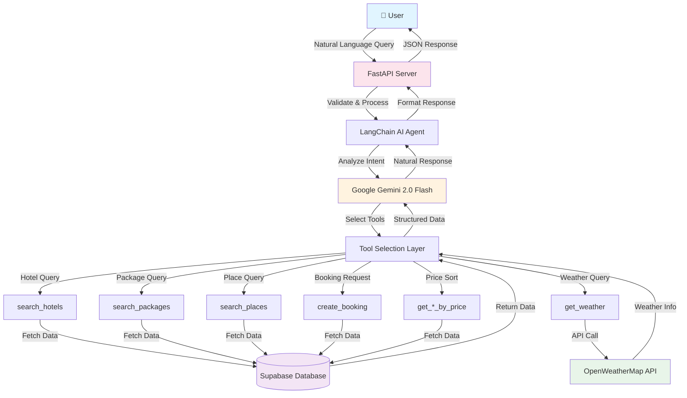

# 🌍 GoTravel AI Backend

**Intelligent AI-Powered Travel Booking Assistant**

A production-ready conversational AI system for travel and tourism, built with FastAPI, LangChain, Google Gemini, and Supabase. Natural language interface for hotel search, package discovery, weather information, and smart bookings.

[](https://fastapi.tiangolo.com)
[](https://www.python.org)
[](https://langchain.com)
[](https://ai.google.dev)

---

## ✨ Features

- 🤖 **Conversational AI** - Natural language chat interface powered by Google Gemini 2.0 Flash
- 🏨 **Smart Hotel Search** - Find accommodations by location, rating, and price
- ✈️ **Package Discovery** - Explore travel packages by destination, category, duration, and budget
- 🗺️ **Tourist Recommendations** - Discover popular places and attractions
- 🌤️ **Real-time Weather** - Get current weather information for any location
- 📝 **Intelligent Bookings** - Create bookings through natural conversation
- 🔄 **Session Management** - Maintains conversation context across multiple interactions
- 🛠️ **Tool-Based Architecture** - Modular LangChain tools for flexible data fetching

---

## 🏗️ System Architecture



### How It Works

1. **User Input** → User sends a natural language query (e.g., "Show me luxury hotels in Dhaka")
2. **Request Processing** → FastAPI validates and routes the request to the AI agent
3. **Intent Analysis** → Google Gemini 2.0 Flash analyzes the query and determines user intent
4. **Tool Selection** → Agent selects appropriate tools (search_hotels, get_weather, etc.)
5. **Data Fetching** → Tools retrieve data from Supabase or external APIs
6. **Response Generation** → Gemini formats data into natural, conversational response
7. **User Response** → FastAPI returns JSON with the AI's response and metadata

---

## 📁 Project Structure (MVC Pattern)

```
gotravel-server/
├── src/                          # Main application code
│   ├── config/
│   │   ├── __init__.py
│   │   └── settings.py           # Environment configuration
│   ├── models/
│   │   ├── __init__.py
│   │   └── schemas.py            # Pydantic request/response models
│   ├── routes/
│   │   ├── __init__.py
│   │   └── api.py                # API endpoints (controllers)
│   ├── services/
│   │   ├── __init__.py
│   │   ├── agent.py              # LangChain AI agent
│   │   ├── database.py           # Supabase client
│   │   └── tools.py              # LangChain tools
│   └── utils/
│       ├── __init__.py
│       └── helpers.py            # Helper functions
├── supabase/
│   └── migrations/               # Database schema
├── main.py                       # FastAPI application entry
├── requirements.txt              # Python dependencies
├── render.yaml                   # Render deployment config
└── API_DOCUMENTATION.txt         # Complete API docs
```

---

## 🛠️ Available AI Tools

The chatbot has access to 11 specialized tools for different tasks:

### 1. Hotel Tools

#### `search_hotels`
Find hotels by location.

**Example Query:** "Show me hotels in Dhaka"

**Parameters:**
```python
city: str = "Dhaka"           # Optional: City name
country: str = "Bangladesh"   # Optional: Country name
```

**What it returns:** Hotel name, location, rating, contact info, description

---

#### `get_hotel_rooms`
Get available rooms for a specific hotel.

**Example Query:** "What rooms are available at this hotel?"

**Parameters:**
```python
hotel_id: str = "abc123..."   # Required: Hotel ID
```

**What it returns:** Room types, prices, capacity, amenities, availability

---

#### `get_hotels_by_price`
Sort hotels by price range.

**Example Query:** "Show me hotels from cheapest to most expensive"

**Parameters:**
```python
city: str = "Dhaka"                    # Optional: Filter by city
country: str = "Bangladesh"            # Optional: Filter by country
sort_order: str = "low_to_high"        # "low_to_high" or "high_to_low"
```

**What it returns:** Hotels sorted by price

---

### 2. Package Tools

#### `search_packages`
Search for travel packages.

**Example Query:** "Find 3-day beach packages under 10000 BDT"

**Parameters:**
```python
destination: str = "Cox's Bazar"      # Optional: Destination name
country: str = "Bangladesh"           # Optional: Country
category: str = "beach"               # Optional: adventure, luxury, beach, cultural
max_price: float = 10000.0            # Optional: Maximum price
duration_days: int = 3                # Optional: Trip duration
```

**What it returns:** Package name, destination, price, duration, category, inclusions

---

#### `get_cheapest_packages`
Find the most affordable packages.

**Example Query:** "What are the cheapest travel packages?"

**Parameters:** None

**What it returns:** Top 5 budget-friendly packages

---

#### `get_packages_by_price`
Sort packages by price.

**Example Query:** "Show packages from low to high price"

**Parameters:**
```python
sort_order: str = "low_to_high"       # "low_to_high" or "high_to_low"
```

**What it returns:** Packages sorted by price

---

### 3. Place Tools

#### `search_places`
Find tourist places and attractions.

**Example Query:** "Show me beaches near Cox's Bazar"

**Parameters:**
```python
country: str = "Bangladesh"           # Optional: Country
city: str = "Cox's Bazar"             # Optional: City
category: str = "beach"               # Optional: beach, mountain, historical, cultural
near_city: str = "Chittagong"         # Optional: Places near this city
```

**What it returns:** Place name, location, category, rating, activities, best time to visit

---

#### `get_popular_places`
Get the most popular tourist destinations.

**Example Query:** "What are the top tourist places?"

**Parameters:** None

**What it returns:** Most visited and highly-rated places

---

### 4. Weather Tool

#### `get_weather`
Get current weather information.

**Example Query:** "What's the weather in Dhaka?"

**Parameters:**
```python
city: str = "Dhaka"                   # Required: City name
```

**What it returns:** Temperature, humidity, conditions, wind speed, weather description

---

### 5. Favorites Tool

#### `get_user_favorites`
Retrieve user's saved favorites.

**Example Query:** "Show my favorite hotels"

**Parameters:**
```python
user_id: str = "user123"              # Required: User ID
item_type: str = "hotel"              # Optional: hotel, package, place
```

**What it returns:** List of user's favorited items

---

### 6. Booking Tool

#### `create_booking`
Create a new booking for packages or hotels.

**Example Query:** "Book this package for 2 people, my name is John Doe"

**Parameters:**
```python
booking_type: str = "package"         # Required: "package" or "hotel"
item_id: str = "abc123..."            # Required: Package/Hotel ID
guest_name: str = "John Doe"          # Required: Guest name
guest_email: str = "john@example.com" # Required: Email
guest_phone: str = "+8801712345678"   # Required: Phone
total_participants: int = 2           # Optional: Number of people (default: 1)
user_id: str = "user123"              # Optional: User ID
```

**What it returns:** Booking reference, total amount, booking status

---

## 💬 What the Chatbot Can Do

### Hotel Queries
- ✅ "Show me luxury hotels in Dhaka"
- ✅ "Find 5-star hotels in Cox's Bazar"
- ✅ "What are the cheapest hotels in Sylhet?"
- ✅ "Show hotels with ratings above 4.5"
- ✅ "What rooms are available at Pan Pacific Hotel?"

### Package Queries
- ✅ "Find beach packages under 15000 BDT"
- ✅ "Show me 3-day adventure packages"
- ✅ "What are the cheapest travel packages?"
- ✅ "Find luxury packages to Sundarbans"
- ✅ "Show cultural tour packages"

### Place Queries
- ✅ "What are the popular tourist places in Bangladesh?"
- ✅ "Show me beaches near Chittagong"
- ✅ "Find historical places in Dhaka"
- ✅ "What places should I visit in Sylhet?"
- ✅ "Show mountain destinations"

### Weather Queries
- ✅ "What's the weather in Cox's Bazar?"
- ✅ "Is it raining in Dhaka?"
- ✅ "What's the temperature in Sylhet?"
- ✅ "How's the weather today in Chittagong?"

### Booking Queries
- ✅ "Book the Cox's Bazar beach package for 2 people"
- ✅ "I want to reserve this hotel, my name is John, email john@mail.com"
- ✅ "Create a booking for 4 participants"

### Conversational
- ✅ Maintains context across messages
- ✅ Remembers previous queries in session
- ✅ Asks clarifying questions
- ✅ Provides recommendations based on conversation
- ✅ Natural, friendly responses with emojis

---

## 🚀 Quick Start

### Prerequisites
- Python 3.11+
- Supabase account
- Google AI API key

### Installation

```bash
# Clone repository
git clone https://github.com/kaiumallimon/gotravel_server.git
cd gotravel_server

# Create virtual environment
python -m venv venv
source venv/bin/activate  # On Windows: venv\Scripts\activate

# Install dependencies
pip install -r requirements.txt

# Set up environment variables
cp .env.example .env
# Edit .env with your API keys

# Run the application
uvicorn main:app --reload
```

### Test the API

```bash
# Health check
curl http://localhost:8000/api/health

# Chat with the AI
curl -X POST "http://localhost:8000/api/chat" \
  -H "Content-Type: application/json" \
  -d '{"message": "Show me hotels in Dhaka", "session_id": "test"}'
```

### Access Documentation
- **Swagger UI:** http://localhost:8000/docs
- **ReDoc:** http://localhost:8000/redoc

---

## 🔧 Configuration

Create a `.env` file with these variables:

```env
# Required
SUPABASE_URL=your_supabase_project_url
SUPABASE_KEY=your_supabase_anon_key
GOOGLE_API_KEY=your_google_gemini_api_key

# Optional
OPENWEATHER_API_KEY=your_openweather_key
DEBUG=true
ALLOWED_ORIGINS=http://localhost:3000
MODEL_NAME=gemini-2.0-flash
TEMPERATURE=0.7
MAX_TOKENS=2048
```

---

## 📡 API Endpoints

| Method | Endpoint | Description |
|--------|----------|-------------|
| GET | `/api/health` | Health check |
| POST | `/api/chat` | Chat with AI assistant |
| POST | `/api/session/info` | Get session info |
| POST | `/api/session/clear` | Clear session history |
| POST | `/api/booking` | Create booking |
| GET | `/docs` | Swagger UI |
| GET | `/redoc` | ReDoc documentation |

For detailed API documentation with request/response examples, see [API_DOCUMENTATION.txt](./API_DOCUMENTATION.txt)

---

## 🚢 Deployment

### Deploy to Render (Recommended)

```bash
# Push to GitHub
git push origin main

# Deploy on Render
# 1. Go to render.com
# 2. New Web Service → Connect repo
# 3. Add environment variables
# 4. Deploy!
```

See [RENDER_DEPLOYMENT.md](./RENDER_DEPLOYMENT.md) for detailed instructions.

---

## 🔌 Technology Stack

- **Backend:** FastAPI, Uvicorn
- **AI/ML:** LangChain, Google Gemini 2.0 Flash
- **Database:** Supabase (PostgreSQL)
- **APIs:** OpenWeatherMap
- **Validation:** Pydantic
- **Architecture:** MVC Pattern

---

## 📄 License

This project is licensed under the MIT License.

---

## 🤝 Contributing

Contributions are welcome! Please feel free to submit a Pull Request.

---

## 📧 Support

For questions or issues, please open an issue on GitHub.

---

**Built with ❤️ for travelers around the world** 🌏✈️
